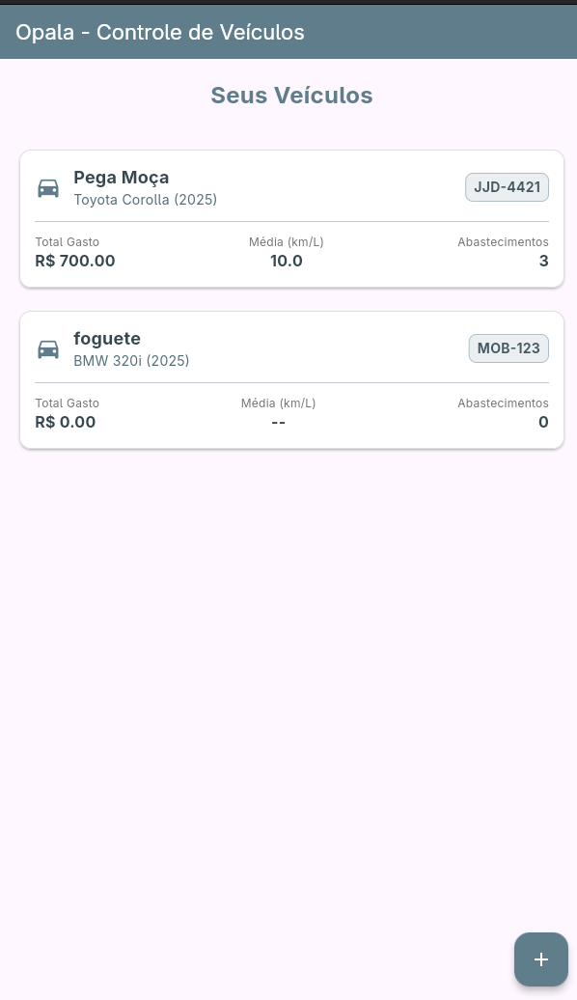
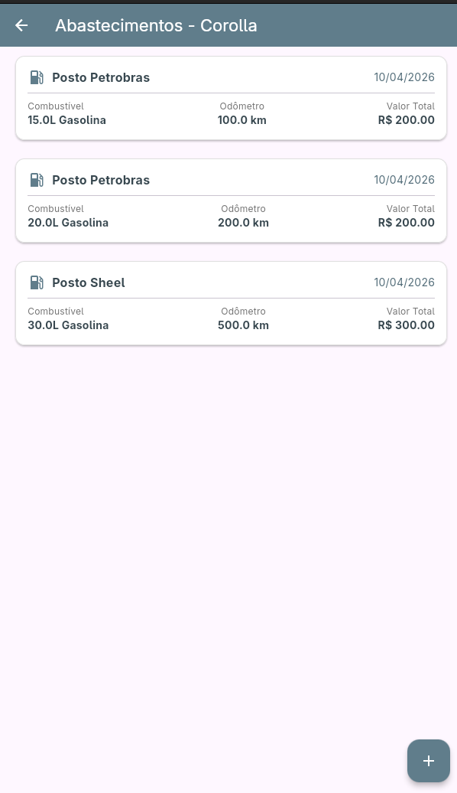

# A1 - Programação para Dispositivos Móveis I

Uma aplicação mobile desenvolvida em Flutter para facilitar a gestão de despesas automotivas, permitindo que motoristas acompanhem consumo de combustível, gastos recorrentes e desempenho individual de cada veículo cadastrado.

## Nome do App

**Opala** (porque bebe muito)

## Sobre o projeto

O aplicativo tem como objetivo facilitar a gestão de despesas automotivas, permitindo que motoristas acompanhem o consumo de combustível e os gastos recorrentes de um ou mais veículos (carros, motos, etc.).

O sistema oferece uma interface onde o usuário pode:

- Cadastrar sua frota pessoal;
- Registrar cada abastecimento (valor, litros, data, quilometragem e posto);
- Visualizar histórico de consumo e custos;
- Alternar entre veículos mantendo histórico e cálculos individualizados;
- Acompanhar médias de gasto e desempenho (km/l) por veículo.

## Requisitos Funcionais

### RF01 - Gestão da Frota (Veículos)
A aplicação deve permitir ao usuário centralizar todos os seus veículos em uma única visualização (Home). Deve listar nome, placa e os indicadores principais atualizados (Total Mensal/Gasto e Média de Consumo - km/L). Também deve ser possível cadastrar novos veículos na frota a qualquer momento e deletar os existentes.

### RF02 - Histórico Individualizado de Abastecimentos
O aplicativo deve fornecer uma tela secundária específica para cada veículo. Quando o usuário acessa um veículo na lista, a aplicação exibe toda a lista do histórico de abastecimentos (detalhando valor pago, quilometragem, tipo de combustível e posto). Permite também a exclusão de abastecimentos pontuais.

### RF03 - Registro de Abastecimentos
O sistema deve possuir um formulário para novos registros dentro do painel de cada veículo. O usuário cadastra no aplicativo (odômetro atual, quantidade de litros e custo total), de forma que os cálculos matemáticos do *RF01* sejam atualizados automaticamente na listagem.

## Screenshots

<div align="center">
  
  &nbsp;&nbsp;&nbsp;
  
</div>

## Stack Utilizada

<span>


</span>

## Rodando Localmente 🖥️

Para executar o projeto em seu ambiente local, siga os passos abaixo.

### Pré-requisitos

- Flutter SDK (versão 3.11.0 ou superior)
- Dart SDK
- Android Studio ou VS Code
- Dispositivo Android/iOS ou emulador configurado

### Passos

1. Clone o repositório:

	```sh
	git clone https://github.com/Matheus-Nardi/opala.git
	```

2. Entre no diretório do repositório:

	```sh
	cd opala
	```

3. Instale as dependências:

	```sh
	flutter pub get
	```

4. Execute a aplicação:

	```sh
	flutter run
	```

5. A aplicação será iniciada no dispositivo ou emulador configurado.
