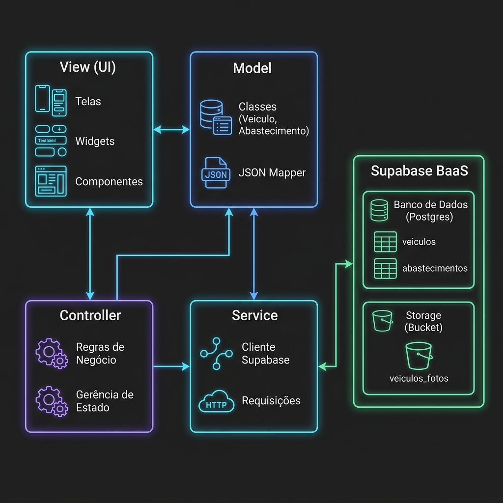
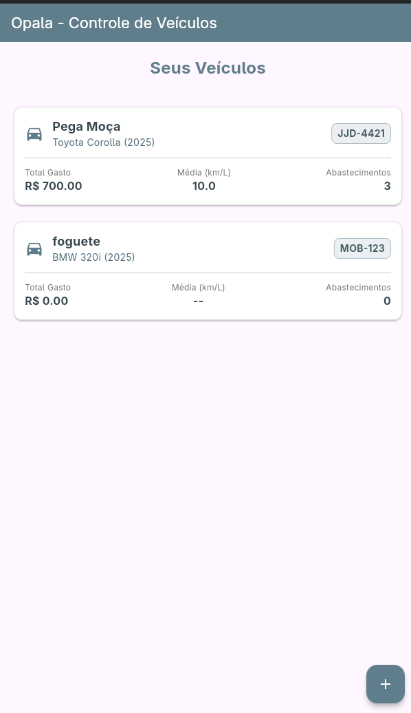
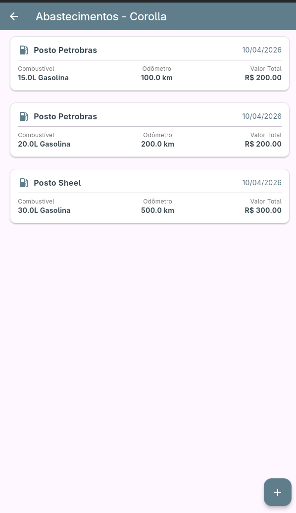

# A1 - Programação para Dispositivos Móveis I

Uma aplicação mobile desenvolvida em Flutter para facilitar a gestão de despesas automotivas, permitindo que motoristas acompanhem consumo de combustível, gastos recorrentes e desempenho individual de cada veículo cadastrado.

## Nome do App

**Opala** (porque bebe muito 🚗💨)

## Sobre o projeto

O aplicativo tem como objetivo facilitar a gestão de despesas automotivas, permitindo que motoristas acompanhem o consumo de combustível e os gastos recorrentes de um ou mais veículos (carros, motos, etc.).

O sistema oferece uma interface moderna e segura onde o usuário pode:

- Realizar login seguro via **Google Sign-In** ou e-mail/senha.
- Visualizar seu perfil de usuário (nome, e-mail e foto do Google) no menu lateral (Drawer).
- Cadastrar sua frota pessoal com fotos personalizadas (com upload integrado ao Storage do Supabase).
- Registrar cada abastecimento (valor, litros, data, quilometragem e posto).
- Visualizar histórico de consumo e custos em tempo real.
- Alternar entre veículos mantendo histórico e cálculos individualizados.
- Acompanhar médias de gasto e desempenho (km/l) por veículo.

## Arquitetura MVCS + Supabase

O projeto adota o padrão de arquitetura **MVCS (Model-View-Controller-Service)** para manter a separação de responsabilidades de forma organizada, escalável e testável.

Abaixo está o fluxo detalhado de comunicação da aplicação com o ecossistema Supabase:

<div align="center">
  
</div>

* **View (UI)**: Telas (`CadastroVeiculoScreen`, `HomePage`, `LoginScreen`) e componentes visuais (`CardVeiculoWidget`) construídos em Flutter que interagem diretamente com o usuário final.
* **Controller**: Classes controladoras (como `AbastecimentoController`) que gerenciam o estado local, aplicam regras de fluxo e reagem aos eventos iniciados nas Views.
* **Service**: Camada intermediária (`VeiculoService`, `AuthService`, `AbastecimentoService`) responsável pelas requisições externas e comunicação direta com o cliente Supabase.
* **Model**: Representação das entidades de negócio (`Veiculo`, `Abastecimento`) contendo mapeadores de conversão de dados (`toMap` / `fromMap`).
* **Supabase Backend**:
  * **Database (PostgreSQL)**: Armazena tabelas relacionais de veículos e abastecimentos protegidas por políticas RLS (Row-Level Security).
  * **Storage (Buckets)**: Guarda as fotos de capa dos veículos armazenadas no bucket público `veiculos_fotos`.
  * **Auth**: Gerencia a autenticação nativa e o fluxo OAuth2 com provedores terceiros (Google Sign-In).

## Requisitos Funcionais

### RF01 - Gestão da Frota (Veículos)
A aplicação permite ao usuário centralizar todos os seus veículos em uma única visualização (Home). Lista nome, placa e os indicadores principais atualizados (Total Mensal/Gasto e Média de Consumo - km/L). Também é possível cadastrar novos veículos na frota a qualquer momento enviando uma foto de capa (banner) e deletar os existentes.

### RF02 - Histórico Individualizado de Abastecimentos
Fornece uma tela secundária específica para cada veículo. Quando o usuário acessa um veículo na lista, a aplicação exibe toda a lista do histórico de abastecimentos (detalhando valor pago, quilometragem, tipo de combustível e posto). Permite também a exclusão de abastecimentos pontuais.

### RF03 - Registro de Abastecimentos
Possui um formulário para novos registros dentro do painel de cada veículo. O usuário cadastra no aplicativo (odômetro atual, quantidade de litros e custo total), de forma que os cálculos matemáticos do *RF01* sejam atualizados automaticamente na listagem.

### RF04 - Autenticação e Perfil do Usuário
Interface de acesso segura que permite login via conta do Google. Uma vez autenticado, o usuário tem acesso a um menu Drawer que exibe sua foto de perfil do Google, nome completo, e-mail de cadastro e opção de encerramento de sessão (Logout).

## Screenshots

<div align="center">
  
  &nbsp;&nbsp;&nbsp;
  
</div>

## Stack Utilizada

<span>
  
  
  
  
  
</span>

## Rodando Localmente 🖥️

Para executar o projeto em seu ambiente local, siga os passos abaixo.

### Pré-requisitos

- Flutter SDK (versão 3.11.0 ou superior)
- Dart SDK
- Conta no [Supabase](https://supabase.com)
- Projeto configurado no Google Cloud Console (para OAuth 2.0 Client ID)
- Dispositivo Android/iOS/Linux ou emulador configurado

### Configuração do Supabase e Ambiente

1. **Variáveis de Ambiente**:
   Crie um arquivo `.env` na raiz do projeto com as credenciais do seu projeto Supabase:
   ```env
   SUPABASE_URL=https://seu-projeto.supabase.co
   SUPABASE_ANON_KEY=sua-chave-anonima-supabase
   ```

2. **Supabase Database Schema**:
   Execute os comandos DDL no editor SQL do seu painel Supabase para criar as tabelas necessárias:
   ```sql
   -- Tabela de Veículos
   create table veiculos (
     id bigint generated by default as identity primary key,
     nome text not null,
     placa text not null,
     foto_url text,
     created_at timestamp with time zone default timezone('utc'::text, now()) not null
   );

   -- Tabela de Abastecimentos
   create table abastecimentos (
     id bigint generated by default as identity primary key,
     veiculo_id bigint references veiculos(id) on delete cascade not null,
     odometro integer not null,
     litros double precision not null,
     custo double precision not null,
     posto text,
     tipo_combustivel text,
     data timestamp with time zone default timezone('utc'::text, now()) not null
   );
   ```

3. **Supabase Storage**:
   * Crie um bucket público chamado `veiculos_fotos`.
   * Crie uma política RLS no bucket com permissão de `INSERT`, `SELECT`, `UPDATE` e `DELETE` para usuários autenticados (`authenticated`) definindo as expressões como `true`.

4. **Autenticação do Google (OAuth 2.0)**:
   * Configure a tela de consentimento OAuth no console do Google Cloud.
   * Crie uma credencial do tipo **Web Application** para receber o fluxo de redirecionamento no localhost.
   * Vincule o Client ID e Client Secret obtidos nas configurações de provedores de autenticação (Auth -> Providers -> Google) no painel do Supabase.

### Passos para Execução

1. Clone o repositório:
	```sh
	git clone https://github.com/Matheus-Nardi/opala.git
	```

2. Entre no diretório do repositório:
	```sh
	cd opala
	```

3. Instale as dependências:
	```sh
	flutter pub get
	```

4. Execute a aplicação:
	```sh
	flutter run
	```
